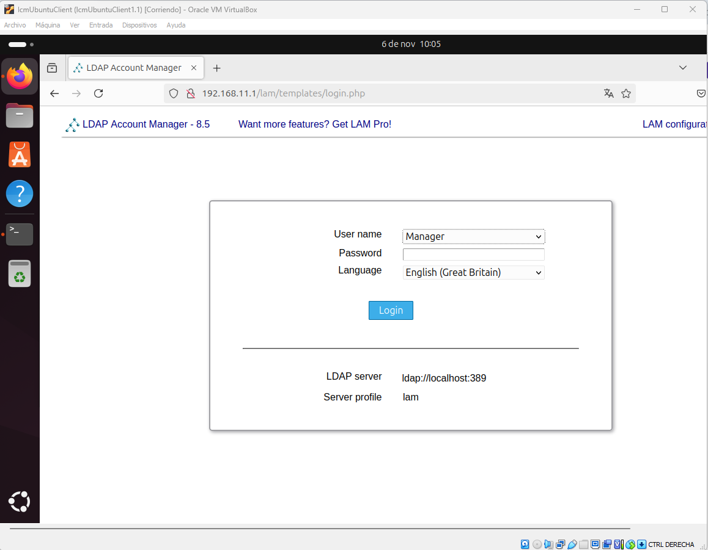
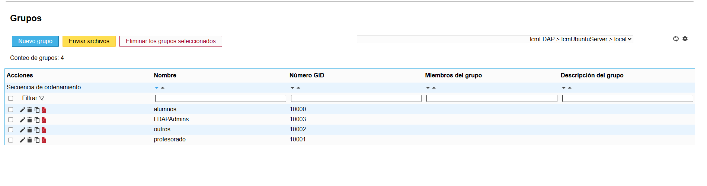
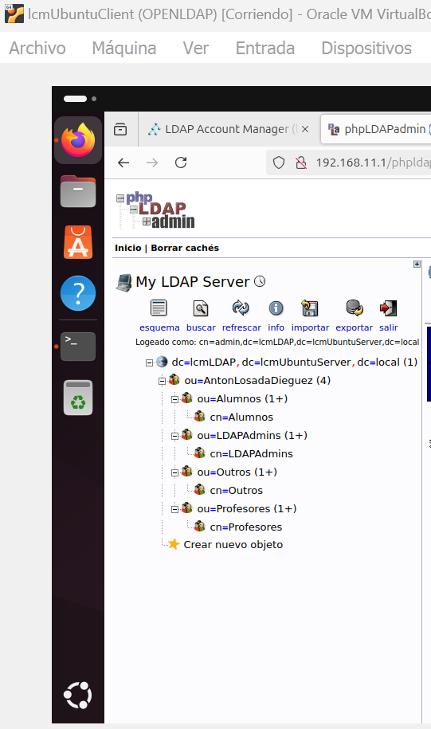
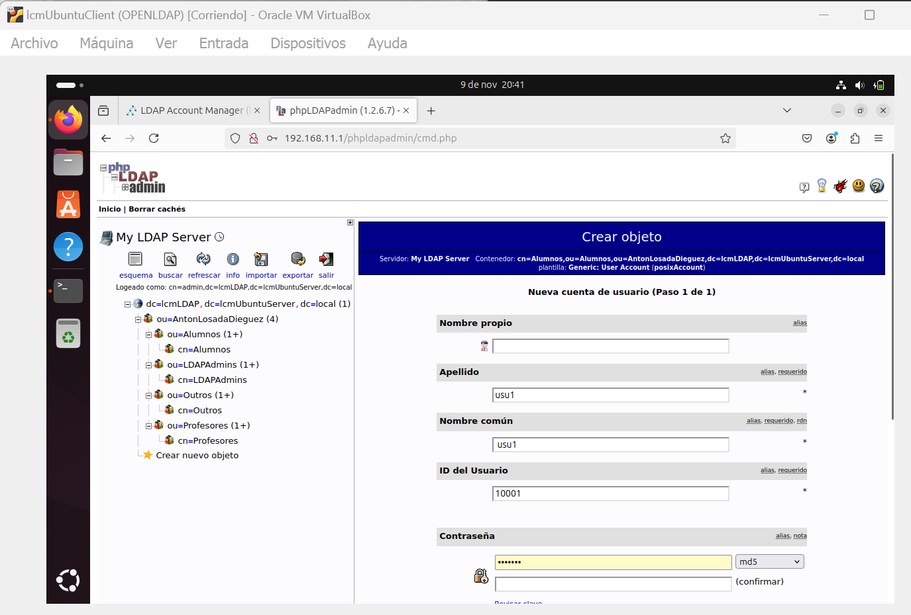

# LDAP Account Manager e phpLDAPAdmin

#### Índice
- OpenLDAPManager
- phpLDAPAdmin 

## OpenLDAPManager
### Instalación de paquetes
Instalamos los siguientes paquetes:
- apache2
- php
- php-cgi
- libapache2-mod-php
- php-mbstring
- php-common
- php-pear

Activamos cgi tras comprobar la version de php y arrancamos apache2  

Instalamos ldap_accountmanager  

### Configuración ldapAccountManager
Desde el archivo /etc/apache2/ldap-account-manager.conf vamos a indicar al servidor quien puede conectarse a LDAPmanager, en este caso vamos a darle permiso a cualquier equipo que se encuentre en la red 192.168.11.0/24  
  
Reiniciamos el servicio apache    
  

Comprobamos que podemos acceder al servidor desde el cliente  

Ahora vamos a configurar para poder conectarnos al server desde el host.  
Comprobamos la ip de host con ipconfig 

Reconfiguramos el archivo /etc/apache2/ldap-account-manager.conf  
  

Reiniciamos el servicio apache    
  

Comprobamos la ip con la que el servidor sale a la red externa  
  

Accedemos al servidor desde el host  

Vamos a editar las configuraciones generales, para ello seguimos la ruta LAM configuration> Edit General Settings y añadimos contraseña maestra por defecto que es *lam*  

Cambiamos la contraseña por defecto  

Antes de entrar vamos a continuar configurando el servidor, seguimos la ruta seguimos la ruta LAM configuration> Edit General Server Profiles , configuramos el idioma por defecto y añadimos nuestro dominio  
  
  

Cambiamos también la contraseña  
  

Accedemos a la pestaña *Tipos de cuentas* y modificamos  

Accedemos a nuestro servidor ldap  

Comprobamos como se muestran todos los usuarios y grupos generados en la anterior práctica  

  

### Eliminación de infraestructura anterior

Eliminamos todos los usuarios y grupos eliminando la unidad organizativa raíz, en nuestro caso ou=AntonLosadaDieguez  
  

### Creación de una nueva infraestructura
Creamos las nuevas unidades organizativas desde el entorno gráfico 
La unidad organizativa padre *AntonLosadaDieguez*
  
Las unidades organizativas *Alumnos*,*Profesores*,*Otros* y *LDAPAdmin*  
  

Creamos los grupos correspondientes a cada unidad organizativa, el objetivo de los grupos es facilitar la gestión de permisos  
  

Creamos los usuarios para cada grupo  
  

## phpLDAPAdmin
Instalamos el aplicativo en el servidor *lcmUbuntuServer*  
   
Configuramos el archivo config de phpldapadmin  
  
Comprobamos como desde un navegador en el cliente podemos acceder al servidor a través de la dirección *http://192.168.11.1/phpldapadmin/*
  
Eliminamos la estructura creada en el ejercicio anterior eliminado la uo principal *AntonLosadaDieguez*, al estar el resto de elementos colgando de la UO principal ya se eliminan por defecto  
  

Creamos una nuevo infraestructura empezando por las UO  
  
Una vez creada la UO padre procedemos a crear las hijas  
  
 

Ahora creamos los grupos dentro de cada uo, empezando por el grupo alumnos dentro de la uo Alumnos  
  
  
  

Creamos un grupo para cada UO  
  

Para poder añadir usuarios a los grupos debemos añadir un atributo a los grupos *memberUID* a través del cual conectaremos grupos y usuarios  
  
Ahora procedemos a crear los usuarios  
  
  
 

Una vez tenemos toda la infraestructura creada queda tal que así  
  

